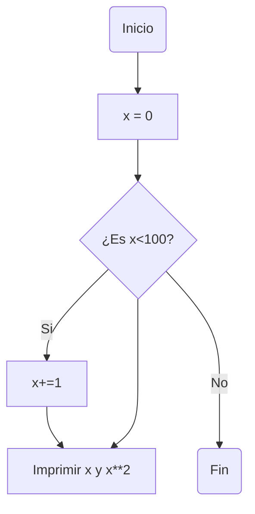
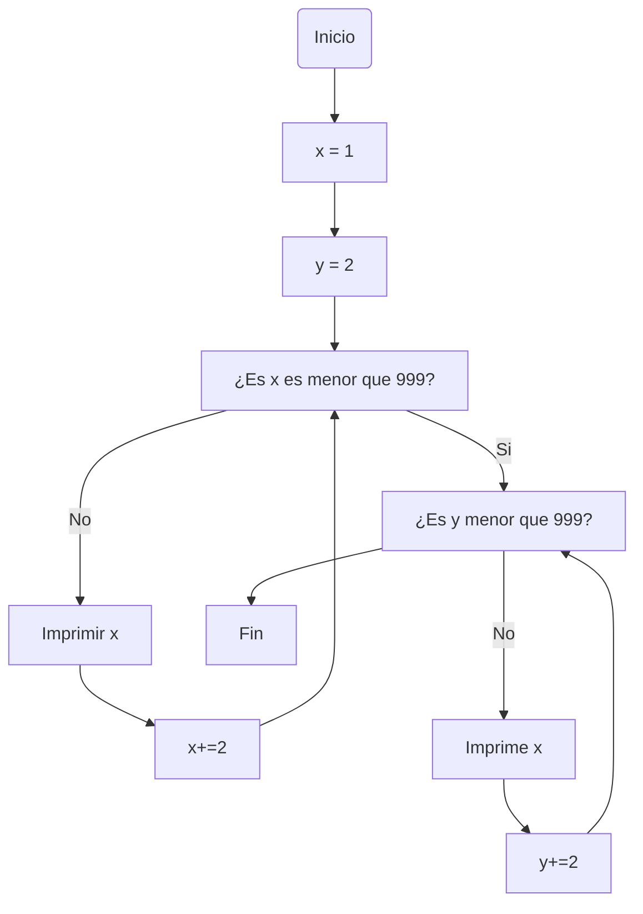
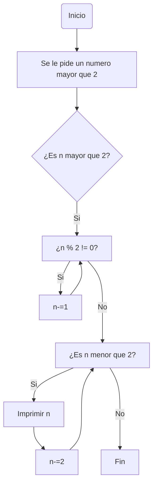

# Reto-7-David-Hoyos
## Punto 1 
Imprimir un listado con los números del 1 al 100 cada uno con su respectivo cuadrado.
```python
#Se declara una variable 
x: int
x = 0 
#Se utiliza un ciclo para imprimir cada numero del 1 al 100 y su respectiva potencia al cuadrado
while x < 100:
    x+=1 
    print(x,x**2)
```

## Punto 2
Imprimir un listado con los números impares desde 1 hasta 999 y seguidamente otro listado con los números pares desde 2 hasta 1000.
```python
#Se declaran dos variables
x: int
y: int 
x = 1
y = 2
print("Listado de numeros pares desde 1 hasta 999")
#Se utiliza un ciclo while para imprimir todos los numeros pares del 2 al 999 
while x < 999:
    print(x)
    x+=2 
print("Listado de numeros impares desde 2 hasta 999")
#Se utiliza un ciclo while para imprimir todos los numeros impares del 1 al 999
while y < 999:
    print(y)
    y+=2
```

## Punto 3
Imprimir los números pares en forma descendente hasta 2 que son menores o iguales a un número natural n ≥ 2 dado
```python
#Se utiliza try para ejecutar el codigo con la excepcion de cuando haya un ValueError
try:
    #Se le pide al usuario un numero natural mayor que 2
    n = int(input("Ingrese un numero natural mayor que 2:  "))
    #Se utiliza if para ejecutar el codigo si el numero introducido es menor que 2 
    if n > 2:   
    #Se utiliza if para restar uno si el numero es impar 
        if n % 2 != 0:
            n -=1
    #Se utiliza un ciclo while para imprimir todos los numeros desde n hasta 2
        while n >= 2:
            print(n)
            n -=2 
    else:
        print("No ingreso un numero natural mayor que 2")
except ValueError:
    print("No ingreso un numero natural mayor que 2")
```

## Punto 4
En 2022 el país A tendrá una población de 25 millones de habitantes y el país B de 18.9 millones. Las tasas de crecimiento anual de la población serán de 2% y 3% respectivamente. Desarrollar un algoritmo para informar en que año la población del país B superará a la de A.
```python
#Se declaran tres variables
pais_a = float(25)
pais_b = float(18.9)
x = int(0)
#Mientras pais a sea menor que pais b, a pais a se le va a sumar 2% y a pais b 3%. Ademas a x se aumenta en uno cada vez que se repita el ciclo 
while pais_a > pais_b:
    pais_a += pais_a * 2/100
    pais_b += pais_b * 3/100
    x += 1
#Se imprime el numero de veces que se repitio el ciclo a 2022 para determinar el año en que la poblacion de b supero a la de a
print(x + 2022)
```
## Punto 5
Imprimir el factorial de un número natural n dado.
```python
#Se utiliza try para ejecutar el codigo con la excepcion de que el usuario no ingrese un numero valido
try:
#Se inicializan dos variables 
    x = int(input("Por favor ingrese un numero entero "))
    y = int(x-1)
#Mientras y sea mayor que 0 el valor de x se convierte en x por y, y se repite el ciclo hasta que la condicion no se cumpla 
    while y > 0:
        x = x * y
        y -= 1
    print(f"El factorial del numero es {x}")
except ValueError:
    print("No ingreso un numero entero")
```
## Punto 6 
Implementar un algoritmo que permita adivinar un número dado de 1 a 100, preguntando en cada caso si el número es mayor, menor o igual.
```python
#Se utiliza try para ejecutar el codigo a menos que el usuario no ingrese un numero valido
try:
# Se importa random
    import random 
# Se define una variable como un numero que elige el usuario y otro que se escoge al azar entre cero y cien utilizando random.randint
    num = int(input("Adivine el numero"))
    num_aleatorio = random.randint(1,100)
#Mientras num != num_aleatorio, si el numero que eligio el usuario es menor que el otro numero se le indica que es menor, mientras que si es mayor se le indica que es mayor. Esto hasta que el usuario acierta
    while num != num_aleatorio:
        if num < num_aleatorio: 
            print("El numero que ingresaste es menor")
            num = int(input("Adivine el numero"))   
        else:
            print("El numero que ingresaste es mayor")
            num = int(input("Adivine el numero"))
    print("Felicidades, adivinaste el numero")
except ValueError:
    print("No ingresaste un numero")
```
## Punto 7
Implementar un programa que ingrese un número de 2 a 50 y muestre sus divisores.
```python
#Se utiliza try para ejecutar el codigo a menos que el usuario no ingrese un numero valido
try:
# Se crean dos variables, una con un valor que elige el usuario y el otro con 0 
    x = int(input("Por favor ingrese un numero entero entre 2 y 50: "))
    n = 0
#Si es x es menor que 50 y mayor que 2, mientras que n sea menor que la mitad de n se le suma 1 y si es divisor de x se imprime n, por ultimo se imprime x, ya que todo numero es divisor de si mismo
    if 2<x<50:
        while n <= x/2:
            n += 1
            if x % n == 0:
                print(n)
        print(x)
    else: 
        print("No ingresaste un numero entero entre 2 y 50")
except ValueError:
    print("No ingresaste un numero entero entre 2 y 50")

```
## Punto 8 
Implementar el algoritmo que muestre los números primos del 1 al 100. Nota: use funciones
```python
# Se establece una funcion para hallar los numeros primos por debajo de cierto numero
def numero_primo(numero:int) -> int:
# mientras el numero sea mayor que 2 modulo=2
  while numero >= 2:
    modulo : int = 2
# Mientras que el numero % modulo != 0 se le sumara uno al modulo
    while numero % modulo != 0:
      modulo += 1
# Si el modulo es mayor que la mitad del numero se imprime el numero 
    if modulo >= numero/2:
      print(numero)
# Se le resta al numero para que de esta manera se evaluen todos los numeros por debajo del numero hasta 2
    numero -= 1
x = 100
numero_primo(x)
```
